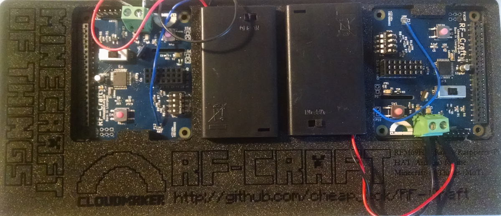

# RF-Craft

 
 

RF-Craft is a prototype Raspberry Pi [HAT](https://github.com/raspberrypi/hats) (**H**ardware **A**ttached on **T**op) arduino clone to send `mcpi` API commands wirelessly to a minecraft server. RF-Craft was built as part of Ross Dalziel's [OK Sparks Project](http://domesticscience.org.uk) and a spin-out from the [FACT](http://fact.co.uk/) [CloudMaker](http://www.fact.co.uk/projects/cloudmaker-making-minecraft-real.aspx) project research and inspired by resilient networks, the work of [Martin O'Hanlon](https://github.com/martinohanlon/mcpi) where `mcpi` is maintained via Mojang, [Shrimping.it](http://start.shrimping.it) and Minecraft modders worldwide. 

Full info from the [CloudMaker Repo](https://github.com/cheapjack/CloudMaker)

It is a board to help teach the **Internet of Things** and is inspired by the wider Minecraft community and culture where young people develop their own skillsets in order to take part in the games culture. In many ways it is the first game in mainstream consciousness where players take control of elements of the games infrastructure, independent of the original developer *Mojang*, often becoming their own **sysadmins** using custom servers for games they want to play and as a consequence, with considerable transferable skills in coding and IoT. 

Minecraft is not an open source project but the game community have, in a sense, opened up elements of it to allow extensive modding and creative hacking. This adhoc technical *culture* is what is the most valuable, not the game itself or even it's potential to educate, which is a consequence of this. After a good deal of research we've concluded that Minecraft is more representative of an independent learning culture and ecosystem on it's own and others borrowed terms and with it's own diversity. This is exciting but not necessarily always helpful to educators or learners.  

With experience, we think it should not really be confused with a universal *service* or *platform* that could be easily exploited for formal mainstream education.

Current owners, Microsoft are developing an education *platform* through [Minecraft Education](https://education.minecraft.net/). This is a very specific version of the game and so has very specific requirements to use. In this sense it *is* a platform, but like many platforms in the real world once you are on one its hard to jump to another without ladders, ropes or expensive jetpacks. We've all played on Parkour servers so we know how hard that can be!

We've tried to package up a range of resources, examples and hardware that could allow you to play with connecting versions of the game with the real world with sensors and buttons. 

Finding the right version of the game to experiment with is difficult and has it's own quite steep and confusing learning curve. We recommend keeping it simple and experimenting on a Pi. The Pi version is version 1.0 or something. It's simple and it's not changing. It's also free. There's an established community out there using the python [mcpi API](https://github.com/martinohanlon/mcpi) for it like [Martin O'Hanlon](https://github.com/martinohanlon/) and making cool stuff for it like [PatternCraft](http://patterncraft.co/).

So we've tried keeping it simple by making simple Raspeberry Pi HATS that can transmit and receive serial messages which you can parse into commands in the Raspberry Pi version of Minecraft you can make simpel HelloWorld Text Adventures, [Models of Railways](https://github.com/cheapjack/RF-Rail-Craft) or all the way up to interacting with [data](https://github.com/cheapjack/MoT), the [International Space Station](https://github.com/astro-pi/SpaceCRAFT) to punchard readers that make music just like PatternCraft.

This Open source Radio messaging system uses the [RFM69HW tranceiver chip](https://lowpowerlab.com/shop/rfm69hw)(based on the Lowpowerlab Moteino) and Frequency 868MHz to report to a central reciever to perform minecraft actions.

Its designed as a Minecraft-of-Things deluxe development board bridging the gap between Pi and Arduino without depending on both. One design parameter was to have good signal penetration through Victorian concrete and the concrete of many arts centres and/or schools for the [Ok Sparks!](http://slyrabbit.net/ok-sparks) project by [Domestic Science](http://domesticscience.org.uk). 

It was designed by artist [Ross Dalziel](http://cheapjack.org.uk) and open source engineer and technician in residence at [DoESLiverpool](http://doesliverpool.com) [Patrick Fenner AKA @DefProc](http://www.deferredprocrastination.co.uk/) and funded by [FACT](http://fact.co.uk/) and  [IT as a Utility (ITaaU) Network](http://www.itutility.ac.uk) for the [CloudMaker](http://www.fact.co.uk/projects/cloudmaker-making-minecraft-real.aspx) project following 2 years of research into the game as a social learning tool which we've since realised is, as we've said, more like a *culture*

### Features

 * On board button and LED, 
 * Digital input for a Dallas DS18B20 one-wire temperature sensor (with pullup resistor) and power rail 
 * 6 analog inputs broken out with power
 * Battery power breakout
 * Pi/External mode jumpers
 * IDE Free reciever/transmitter/Node programming switch
 * It can act as a powered HAT reciever/transmitter on board a Pi or as an independent battery powered arduino radio receiver or transmitter.
 * Open Source: Not cheap but open; but you can build them yourself!
 * Good singnal penetration through concrete castles
 * Need IoT Minecraft workshop & WiFi Down? Network Administrator at lunch? Got Pi, Got HAT Got RF-Craft - no problem!
 * Need radio arduinos for IoT prototype? Sick of Minecraft? Caps falling out of your shrimp? No problem use elsewhere!
 * Send Commands to a Receiver HAT and your Raspbians local Minecraft Pi Edition server
 * Send Commands to the Rasperry Juice Plugin on a CanaryMod server
 * Send Commands to the Rasperry Juice Plugin on `mc.fact.co.uk:25589`

### Message Format

messages are constructed of a `uint8_t` for node_id, followed by an `int8_t` for action

Possible action messages:

 * -1 : set_id
 *  0 : query_id
 *  1 : button press
 *  2 : error
 *  3 : OK

common key for messages: "changemechangeme"

all radios are in group: 87

Transmitter `node_ids` for buttons can be 1-100 but the onboard `node_id` switch can set them to 1-15 in Binary. By default with the big mode switch set to **EXT** the HAT is in transmitter mode and you need to set the `node_id` switch to 1-15. When the mode switch is set to **RPI** then the `node_id` is 254 which is a receiver. 

### Getting Started

The easiest thing to do is clone this repo into your `/home/pi` folder either with git or `wget https://github.com/cheapjack/RF-Craft/archive/master.zip` then `unzip`

You can install git with `sudo apt-get install git-core`
Then `git clone https://github.com/cheapjack/RF-Craft.git`

Then you can modify the `HelloPi.py` or `HelloSerial.py` `python 2.7` code and play with the transmitter and receiver boards pairs out of the box without even having to put the arduino sketches on. Unless you're making them yourselves from the details in the repo then well it's your box.

Then for full details you can read the nearby `GettingStarted.md` file

### RF-Craft

### Background

[The Minecraft Of Things](http://minecraftofthings.tumblr.com) sprang from research with [FACT](http://fact.co.uk/), [Dr Mark Wright](https://twitter.com/dr_mark_wright), [Adrian McEwen](http://www.mcqn.com/) and Paul Harter of [PrintCraft](http://www.printcraft.org/) funded by [IT as a Utility (ITaaU) Network](http://www.itutility.ac.uk) for the [CloudMaker](http://www.fact.co.uk/projects/cloudmaker-making-minecraft-real.aspx) project

Looking into how the Raspberry Pi could be used as an entry into embedded systems, physical computing and the Internet Of Things(IoT) we developed something that could be used in many contexts with simplicity at its core and with ideas that touched on data literacy, resilient networks and security. 

One of the big issues with use of Minecraft in education is networking often educators dont have the time or access to setup a school network for a wireless sensors to communicate with the game; we wanted to be able to be independent of this and for people to setup their own adhoc networks to follow how networks are used in real world applications.

For the final distribution of CloudMaker research we focussed on packaging up resources to help understand the Internet Of Things through Minecraft.

We took diverse approaches to reflect real IoT ecosystems; tried not to re-invent the wheel but point to fascinating education work going on in technology and post 'Maker' culture. 

We made simple arduino on a breadboard interfaces inspired by [Shrimping.It](http://start.shrimping.it) for interacting with minecraft over wired USB/FTDI adaptors, [ShrimpCraft](https://github.com/cheapjack/ShrimpCraft), a WiFi on a breadboard system [Cockle-Craft-of-Things](https://github.com/mcqn/cocklecraft-of-things) with MCQN Ltd. 

For RF-Craft we made a super robust custom PCB arduino RFM69 clone that has a more plug & python & play approach.

The receiver button pairs allow you to send wireless messages to a range of minecraft servers for augmented reality gaming and learning the Internet of Things (IoT) 

### Resources

This uses Martin O'Hanlon's [mcpi API](https://github.com/martinohanlon/mcpi) the Minecraft: Pi Edition API Python Library and his and Zhuowei's [Canary Raspberry Juice](https://github.com/martinohanlon/CanaryRaspberryJuice) plugin for use with FACT's CloudMaker Minecraft Server

### The FACT Server

The FACT CloudMaker Server is a server for prototyping multiplayer `mcpi` activity. Details for how to log on are at the [CloudMaker portal repo](https://github.com/cheapjack/CloudMaker/)

#### Plugins

 * Printbot
 * ScriptCraft
 * WorldEdit
 * Essentials

You can view the [Minecraft CloudMaker Server with this link](http://89.34.96.47:8125/)

